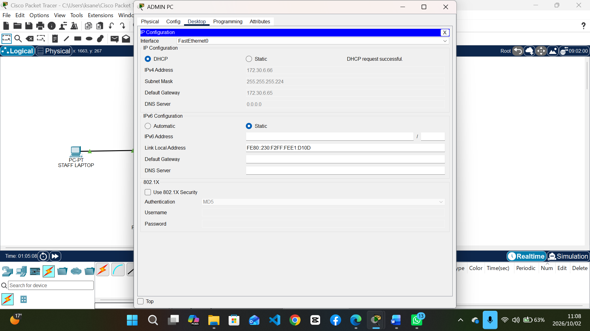
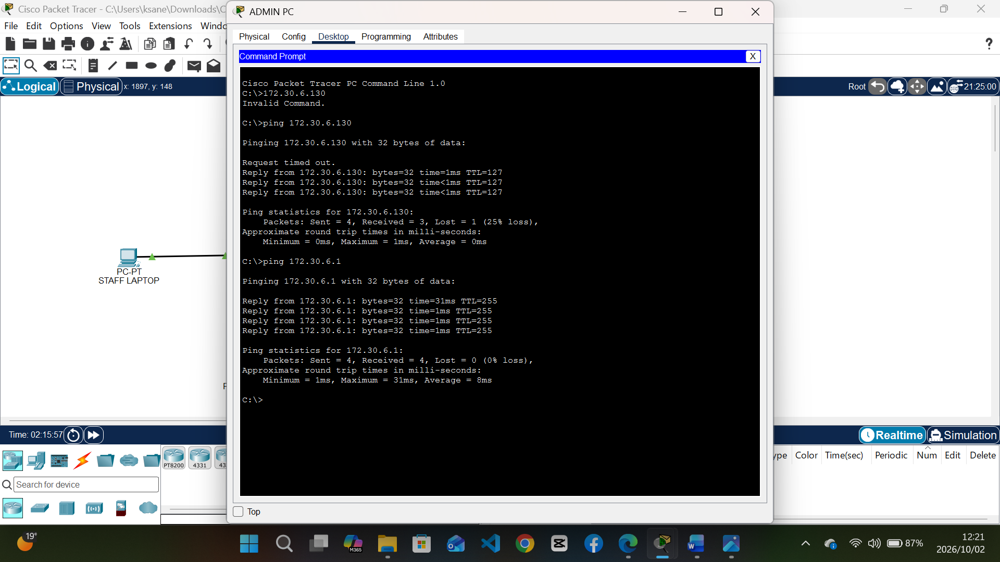
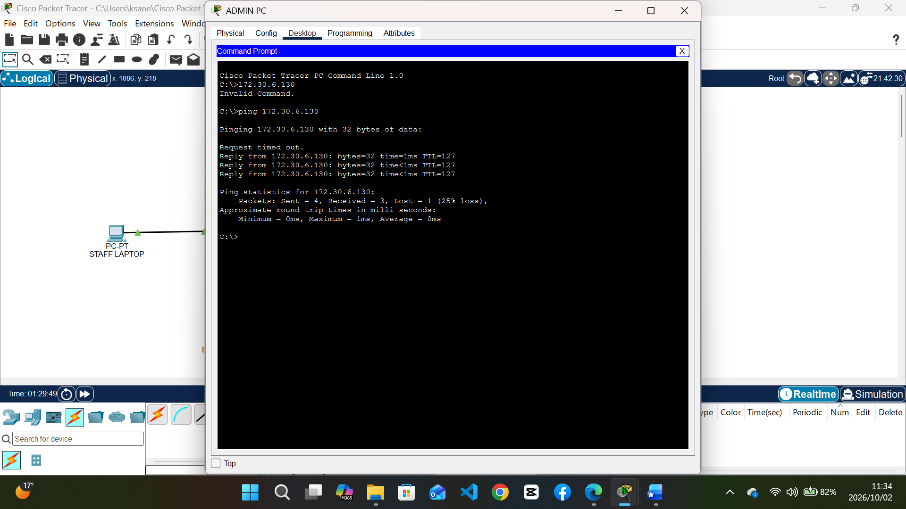
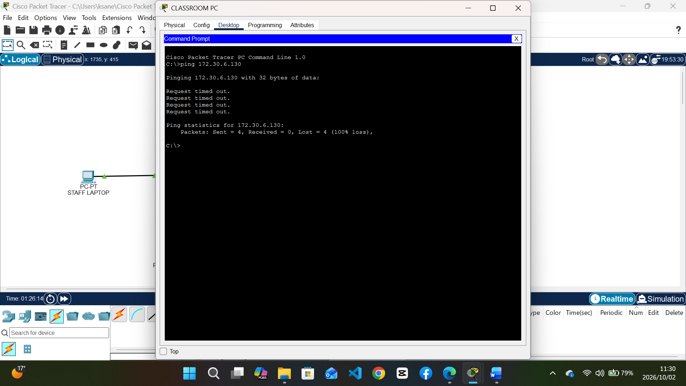

# Testing Evidence

### 1. VLSM & DHCP Verification
The Admin PC successfully received an IP address from the DHCP pool within the assigned VLSM range.

*(Figure 1: Admin PC receiving IP 172.30.6.66 via DHCP)*

### 2. Inter-VLAN Routing
The Admin PC can successfully communicate with other VLANs through the Router-on-a-Stick.

*(Figure 2: Successful ping from Admin to Classroom gateway)*

### 3. CR4 - Authorized Access (Success)
The Admin PC is authorized to access the new File Server.

*(Figure 3: Successful ping from Admin PC to File Server)*

### 4. CR4 - Unauthorized Access (Blocked)
The Classroom PC is blocked from accessing the File Server due to the ACL.

*(Figure 4: Ping from Classroom PC to File Server timing out as expected)*
